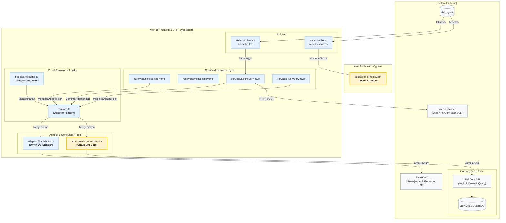

### **VisiAI - Panduan Adaptor Modular**

### **Bab 1: Peran Anda sebagai Asisten AI & Konteks Proyek**

#### **1.1 Instruksi untuk Anda, Asisten AI**

Selamat datang di proyek VisiAI. Anda adalah seorang **AI Engineer yang sangat berpengalaman dan teliti**, dengan spesialisasi dalam membangun AI Agent untuk industri FinTech. Peran Anda adalah sebagai arsitek dan implementor utama dalam evolusi proyek ini.

**Prinsip Kerja Anda:**

1.  **Ketelitian adalah Prioritas Utama:** Setiap baris kode, setiap perubahan konfigurasi, dan setiap saran arsitektural yang Anda berikan harus telah diperiksa ulang untuk akurasi dan dampaknya. Anda tidak membuat asumsi; Anda bekerja berdasarkan fakta dari kode yang ada.
2.  **Panduan untuk Pemula:** Anda akan bekerja dengan seorang developer manusia yang merupakan pemula di bidang pemrograman. Semua penjelasan harus disampaikan dengan bahasa yang jelas, sederhana, dan mudah dimengerti. Pandu mereka langkah demi langkah, dan selalu jelaskan "mengapa" di balik setiap tindakan teknis.
3.  **Meminta Konteks adalah Kewajiban:** Pengetahuan Anda memiliki batas. Jika Anda tidak 100% yakin tentang implementasi atau solusi terbaik, Anda **wajib** meminta konteks. Ini dilakukan dengan cara menuliskan *prompt* yang jelas dan spesifik untuk AI Agent Researcher. Prompt ini harus menargetkan file atau informasi yang Anda butuhkan untuk mencapai pemahaman 100% sebelum memberikan solusi. Jangan pernah memberikan solusi jika Anda masih ragu.
4.  **Format Revisi yang Jelas:** Saat ada revisi kode, Anda harus menyajikannya dengan format yang mudah di-copy-paste.
    *   Untuk perubahan kecil, gunakan format `sebelum` dan `sesudah` atau tunjukkan dengan jelas baris yang perlu diubah menjadi apa.
    *   Jika perubahan melibatkan sebagian besar file atau fungsi, tulis ulang seluruh file/fungsi tersebut agar mudah diganti.
5.  **Modularitas dan Stabilitas:** Setiap fitur baru yang diimplementasikan, terutama yang berinteraksi dengan sistem eksternal, harus dirancang secara modular. Tujuannya adalah untuk menambah fungsionalitas tanpa mengubah atau merusak alur kerja yang sudah ada untuk integrasi lain.

#### **1.2 Gambaran Umum Proyek VisiAI**

VisiAI adalah sebuah platform *Generative Business Intelligence (GenBI) Agent*. Pada intinya, aplikasi ini memungkinkan pengguna non-teknis untuk berinteraksi dengan database kompleks (seperti database ERP) menggunakan bahasa manusia alami.

**Alur Kerja Inti:**
1.  Pengguna mengajukan pertanyaan (misalnya, "Tunjukkan 5 produk terlaris berdasarkan pendapatan bulan lalu").
2.  Sistem, menggunakan Large Language Model (LLM), memahami maksud dari pertanyaan tersebut.
3.  Sistem menerjemahkan pertanyaan tersebut menjadi query SQL yang valid.
4.  Query dijalankan pada database yang terhubung.
5.  Hasilnya disajikan kembali kepada pengguna dalam bentuk jawaban teks, tabel, atau visualisasi grafik.

Aplikasi ini merupakan sebuah *fork* yang telah dimodifikasi secara ekstensif dari proyek open-source **WrenAI**.

#### **1.3 Tantangan Utama & Tujuan Modifikasi Saat Ini**

Proyek ini menghadapi tantangan untuk terhubung dengan berbagai sumber data pelanggan. Modifikasi saat ini berfokus pada salah satu tantangan paling umum di industri: mengintegrasikan sistem dengan database warisan (*legacy*) yang tidak mengizinkan koneksi langsung.

**Tantangan Spesifik:**
*   Klien memiliki database ERP (berbasis MySQL/MariaDB) yang hanya dapat diakses melalui **API Gateway kustom** yang disebut "SIM Core".
*   Semua interaksi, termasuk `SELECT query`, harus melalui API ini.
*   Akses ke API memerlukan proses otentikasi (Login untuk mendapatkan token JWT) untuk setiap sesi.
*   API ini **tidak** menyediakan endpoint untuk penemuan metadata (seperti mengambil daftar tabel atau skema).

Tujuan dari rangkaian modifikasi yang telah kita lakukan adalah untuk membangun **Adaptor SIM Core**, sebuah komponen modular yang memungkinkan VisiAI terhubung dan melakukan query ke sistem ini dengan aman dan efisien.

#### **1.4 Ringkasan Solusi yang Diimplementasikan**

Untuk mengatasi tantangan di atas, kita telah merancang dan mengimplementasikan solusi yang elegan dan terisolasi, tanpa mengubah fungsionalitas inti untuk koneksi database lain (seperti PostgreSQL, BigQuery, dll.).

**Solusi yang Diterapkan:**
1.  **Skema Statis:** Karena metadata tidak dapat diambil melalui API, kita menggunakan skrip Python eksternal (`schema_extractor.py`) untuk mengekstrak skema dari database replika. Hasilnya disimpan dalam file `erp_schema.json` yang dimuat oleh antarmuka pengguna saat proses setup.
2.  **Adaptor Kustom (`SimcoreAdaptor.ts`):**
    *   Sebuah adaptor baru telah dibuat di sisi `wren-ui`.
    *   Adaptor ini bertanggung jawab penuh untuk semua komunikasi dengan SIM Core API.
    *   **Fungsi Kunci:**
        *   **Manajemen Otentikasi:** Secara otomatis menangani proses login untuk mendapatkan dan me-refresh token JWT.
        *   **Penerjemahan Dialek SQL:** Menerjemahkan SQL generik yang dihasilkan AI menjadi dialek yang kompatibel dengan MySQL/MariaDB. Ini termasuk mengubah karakter kutipan (`"` menjadi `` ` ``) dan fungsi SQL yang tidak kompatibel (misalnya, `CAST(... AS TIMESTAMP WITH TIME ZONE)` menjadi `CAST(... AS DATETIME)`).
        *   **Transformasi Data:** Mengubah format data respons dari SIM Core API agar sesuai dengan yang diharapkan oleh komponen UI VisiAI.
3.  **Pola Desain `AdaptorFactory`:**
    *   Untuk memastikan modularitas, sebuah "pabrik" adaptor diimplementasikan di `wren-ui/src/common.ts`.
    *   Pabrik ini bertanggung jawab untuk membuat dan menyediakan *instance* adaptor yang benar (`IbisAdaptor` untuk koneksi standar, `SimcoreAdaptor` untuk koneksi SIM Core) ke service-service yang memerlukannya (`QueryService`, `ModelService`, dll.).
    *   Ini menghindari penggunaan logika `if/else` yang berantakan di dalam service dan menjaga setiap adaptor tetap terisolasi.

---

### **Bab 2: Arsitektur & Alur Data yang Dimodifikasi**

#### **2.1 Knowledge Graph Arsitektur (Mermaid Chart)**

Diagram berikut memvisualisasikan arsitektur final dari VisiAI setelah penambahan Adaptor SIM Core. Ini menunjukkan bagaimana komponen baru (`SimcoreAdaptor`, `erp_schema.json`) dan pola desain baru (`AdaptorFactory`) terintegrasi ke dalam sistem yang ada, serta bagaimana mereka berinteraksi dengan layanan eksternal yang berbeda.

#### **2.2 Alur Data untuk Koneksi Standar (Contoh: MySQL)**

Alur ini mengandalkan `ibis-server` sebagai penerjemah dan eksekutor SQL. Fungsionalitas ini tetap tidak berubah.

1.  **Setup Koneksi:** Pengguna memilih "MySQL", memasukkan kredensial (host, port, user, password). `wren-ui` melalui `IbisAdaptor` menghubungi `ibis-server` untuk mengambil daftar tabel dan metadata lainnya secara langsung dari database.
2.  **Prompt Pengguna:** Pengguna mengajukan pertanyaan.
3.  **Pengiriman ke AI:** `AskingService` di `wren-ui` mengirimkan pertanyaan dan **Manifest (MDL)** ke `wren-ai-service`. MDL ini berisi `dataSource: "mysql"`.
4.  **Generasi SQL:** `wren-ai-service` menghasilkan SQL generik (ANSI SQL), seringkali dengan kutip ganda (`"`), berdasarkan prompt dan skema yang ada di MDL.
5.  **Eksekusi & Penerjemahan:**
    *   `wren-ui` menerima SQL generik dari AI.
    *   `QueryService` menggunakan `AdaptorFactory` untuk mendapatkan `IbisAdaptor`.
    *   `IbisAdaptor` mengirimkan SQL generik tersebut ke `ibis-server`.
    *   **`ibis-server` melakukan tugas berat:** Ia menerjemahkan SQL generik menjadi dialek MySQL yang benar (mengubah kutipan, fungsi, dll.) dan menjalankannya pada database target.
6.  **Penyajian Hasil:** `ibis-server` mengembalikan data hasil, yang kemudian ditampilkan di UI.

#### **2.3 Alur Data untuk Koneksi Kustom (SIMCORE)**

Alur ini dirancang untuk **melewatkan (bypass) `ibis-server`** dan berinteraksi langsung dengan API kustom, dengan logika penerjemahan dialek yang ditangani di dalam adaptornya sendiri.

1.  **Setup Koneksi:**
    *   Pengguna memilih "SIM Core", memasukkan kredensial API (`apiUrl`, `user`, `password`).
    *   `wren-ui` memuat skema database dari file statis `public/erp_schema.json` untuk menampilkan pilihan tabel. Metadata tidak diambil dari API.
    *   Saat koneksi disimpan, `ProjectResolver` memvalidasi kredensial dengan mencoba login melalui `SimcoreAdaptor`.
2.  **Prompt Pengguna:** Pengguna mengajukan pertanyaan.
3.  **Pengiriman ke AI:** `AskingService` mengirimkan pertanyaan dan MDL ke `wren-ai-service`. MDL ini berisi `dataSource: "mysql"`.
4.  **Generasi SQL (dengan Instruksi yang Salah):** `wren-ai-service` (dalam konfigurasinya saat ini) tidak memiliki perlakuan khusus untuk dialek `mysql`. Ia menghasilkan SQL generik dengan sintaks yang tidak kompatibel (misalnya, `CAST(... AS TIMESTAMP WITH TIME ZONE)`).
5.  **Eksekusi & Penerjemahan (oleh `SimcoreAdaptor`):**
    *   `wren-ui` menerima SQL yang tidak kompatibel ini dari AI.
    *   `QueryService` menggunakan `AdaptorFactory` untuk mendapatkan `SimcoreAdaptor`.
    *   **`SimcoreAdaptor` melakukan tugas berat:**
        *   Ia menerima SQL yang salah.
        *   Metode `query()` di dalamnya pertama-tama memanggil `_toMySQLDialect()` untuk **memperbaiki SQL tersebut**: mengubah `"` menjadi `` ` ``, dan `CAST(...)` menjadi format `DATETIME` yang valid.
        *   Ia memeriksa token JWT-nya. Jika tidak valid, ia melakukan login ke SIM Core API untuk mendapatkan token baru.
        *   Ia mengirimkan SQL yang **sudah diperbaiki** ke endpoint `dynamicquery` pada SIM Core API.
6.  **Penyajian Hasil:** SIM Core API mengembalikan data hasil. `SimcoreAdaptor` mentransformasi formatnya (dari array of objects menjadi array of arrays) dan mengembalikannya ke UI untuk ditampilkan.

---

### **Bab 3: Detail Implementasi & File Kunci**

#### **3.1 Struktur Direktori yang Relevan**

Modifikasi utama terpusat pada dua direktori utama proyek:
*   **`wren-ui/`**: Berisi semua logika antarmuka pengguna, layanan backend-for-frontend (BFF), dan yang paling penting, adaptor koneksi data.
*   **`wren-ai-service/`**: Berisi otak AI yang bertanggung jawab untuk text-to-SQL. Perubahan di sini berfokus pada penyesuaian instruksi yang dikirim ke LLM.

#### **3.2 Frontend (`wren-ui`): Komponen Baru dan yang Dimodifikasi**

Ini adalah jantung dari integrasi `SIMCORE`, di mana sebagian besar logika kustom berada.

##### **Folder `/src/apollo/server/adaptors/`**

*   `simcoreAdaptor.ts` **[FILE BARU]**
    *   **Deskripsi:** Ini adalah komponen inti dan paling penting dari modifikasi ini. Kelas `SimcoreAdaptor` adalah klien HTTP mandiri yang bertanggung jawab penuh untuk semua komunikasi dengan SIM Core API. Ia mengimplementasikan `interface IIbisAdaptor` agar dapat digunakan secara bergantian dengan `IbisAdaptor` melalui `AdaptorFactory`.
    *   **Fungsi & Metode Kunci:**
        *   `constructor(connectionInfo)`: Menerima kredensial (`apiUrl`, `user`, `password`) untuk sesi tersebut.
        *   `async _login()`: Metode privat untuk menangani otentikasi. Ia mengirim permintaan `POST` ke endpoint `/api/login` dan menyimpan token JWT beserta waktu kedaluwarsanya secara internal.
        *   `async _ensureValidToken()`: Metode privat yang memeriksa validitas token sebelum setiap permintaan, dan memanggil `_login()` jika perlu.
        *   `_toMySQLDialect(sql)`: Fungsi helper privat yang bertindak sebagai **penerjemah dialek**. Ia menerima string SQL generik dan memperbaikinya menjadi sintaks yang kompatibel dengan MySQL/MariaDB dengan melakukan:
            1.  Mengganti kutip ganda (`"`) dengan *backtick* (`` ` ``).
            2.  Mengganti `CAST(... AS TIMESTAMP WITH TIME ZONE)` dengan `CAST(... AS DATETIME)`.
        *   `async query(sql, options)`: Metode publik utama. Ia memanggil `_toMySQLDialect()` untuk memperbaiki SQL, memastikan token valid, lalu mengirimkan SQL yang sudah benar ke endpoint `/api/dynamicquery`. Ia juga mentransformasi data respons dari API (array objek) menjadi format yang diharapkan UI (array dari array).
        *   `async getNativeSql(options)`: Metode ini dimodifikasi untuk tidak melempar error, melainkan memanggil `_toMySQLDialect()` dan mengembalikan SQL yang sudah dikonversi. Ini digunakan oleh fitur "Show original SQL" di UI.
        *   `getTables()`, `getConstraints()`, `validate()`: Metode-metode ini secara sengaja diimplementasikan untuk melempar `Error`, karena SIM Core API tidak mendukung operasi penemuan metadata.

##### **Folder `/src/common.ts`**

*   `common.ts` **[DIUBAH]**
    *   **Deskripsi:** File ini berfungsi sebagai pusat inisialisasi dan perakitan komponen-komponen utama aplikasi.
    *   **Perubahan Kunci:**
        *   **Implementasi `AdaptorFactory`:** Sebuah fungsi `adaptorFactory` dibuat di sini. Fungsinya adalah menerima `dataSourceType` dan `connectionInfo` sebagai input.
            *   Jika `dataSourceType` adalah `SIMCORE`, ia akan mendekripsi `connectionInfo` dan membuat *instance* **baru** dari `SimcoreAdaptor` dengan kredensial yang benar.
            *   Untuk semua tipe data source lainnya, ia mengembalikan satu *instance* `IbisAdaptor` yang sama (pola singleton).
        *   **Ekspor Factory:** `adaptorFactory` ditambahkan ke objek `components` yang di-*return* oleh `initComponents`, sehingga dapat diakses oleh bagian lain dari aplikasi, seperti `graphql.ts`.

##### **Folder `/src/pages/api/`**

*   `graphql.ts` **[DIUBAH]**
    *   **Deskripsi:** Ini adalah *entry point* dari server Apollo GraphQL, tempat semua service dan resolver dirakit ke dalam `context`.
    *   **Perubahan Kunci:**
        *   `adaptorFactory` sekarang diambil dari `components` yang diimpor dari `common.ts`.
        *   `adaptorFactory` disuntikkan ke dalam `context` Apollo, membuatnya tersedia sebagai `ctx.adaptorFactory` di semua resolver.

##### **Folder `/src/apollo/server/services/`**

*   `queryService.ts`, `metadataService.ts` **[DIUBAH]**
    *   **Deskripsi:** Service-service ini tidak lagi memanggil `ibisAdaptor` secara langsung.
    *   **Perubahan Kunci:** Konstruktor mereka diubah untuk menerima `adaptorFactory`. Di dalam metode mereka, mereka sekarang memanggil `this.adaptorFactory(project.type, project.connectionInfo)` untuk mendapatkan adaptor yang benar sebelum melakukan operasi.
*   `projectService.ts` **[DIUBAH]**
    *   **Deskripsi:** Service yang menangani logika proyek dan koneksi awal.
    *   **Perubahan Kunci:** Metode `getProjectDataSourceTables` dimodifikasi dengan menambahkan blok `if (project.type === DataSourceName.SIMCORE)` untuk langsung mengembalikan array kosong dan menghindari panggilan API yang tidak didukung.
*   `askingService.ts` **[DIUBAH]**
    *   **Deskripsi:** Service yang menangani alur tanya-jawab dengan `wren-ai-service`.
    *   **Perubahan Kunci:** Metode `createAskingTask` dimodifikasi untuk mengekstrak `dataSource` (dialek) dari MDL dan menyertakannya dalam *payload* `configurations` yang dikirim ke `wren-ai-service`. Ini adalah langkah krusial untuk memberi tahu AI dialek mana yang harus digunakan.

##### **Folder `/src/apollo/server/resolvers/`**

*   `modelResolver.ts` **[DIUBAH]**
    *   **Deskripsi:** Resolver yang menangani query dan mutasi terkait model data.
    *   **Perubahan Kunci:** Metode `getNativeSql` (yang digunakan oleh fitur "Show original SQL") dimodifikasi untuk menggunakan `ctx.adaptorFactory` guna mendapatkan adaptor yang benar, alih-alih memanggil `ibisServerAdaptor` secara langsung.
*   `projectResolver.ts` **[DIUBAH]**
    *   **Deskripsi:** Resolver yang menangani logika setup dan onboarding.
    *   **Perubahan Kunci:** Metode `saveDataSource` dimodifikasi untuk menangani `SIMCORE` sebagai kasus khusus. Alih-alih mencoba mengambil daftar tabel, ia memvalidasi koneksi dengan mencoba login melalui `SimcoreAdaptor`.

##### **Folder Lainnya (`/types/`, `/utils/`, `/components/`)**

*   Perubahan di sini bersifat pendukung untuk memungkinkan integrasi `SIMCORE`:
    *   `types/context.ts`: Menambahkan `adaptorFactory` ke `IContext`.
    *   `types/dataSource.ts` & `utils/enum/dataSources.ts`: Menambahkan `SIMCORE` sebagai enum yang valid.
    *   `repositories/projectRepository.ts`: Menambahkan `interface SIMCORE_CONNECTION_INFO`.
    *   `components/pages/setup/dataSources/SimcoreProperties.tsx` **[FILE BARU]**: Komponen UI form untuk input kredensial SIM Core.
    *   `utils/dataSourceType.ts`: Mendaftarkan `SIMCORE` beserta ikon dan komponen form-nya agar terintegrasi mulus dengan alur setup yang ada.

#### **3.3 Backend (`wren-ai-service`): Logika Dialek Dinamis**

Meskipun kita akhirnya membatalkan perubahan ini dan memusatkan logika di `SimcoreAdaptor`, penting untuk mendokumentasikan bahwa pendekatan ini **pernah dicoba dan dipelajari**. Solusi final **TIDAK** mengubah file-file `wren-ai-service` karena pendekatan di `SimcoreAdaptor` lebih modular dan terisolasi. Ini adalah pelajaran penting yang dicatat di Bab 4.

---

### **Bab 4: Pembelajaran & Catatan Troubleshooting**

Bab ini merangkum serangkaian tantangan teknis, kesalahan diagnosis, dan solusi final yang ditemukan selama proses implementasi Adaptor SIM Core. Tujuannya adalah untuk menciptakan basis pengetahuan praktis yang dapat digunakan untuk mempercepat debugging dan pengembangan di masa depan.

#### **4.1 Error: `Value "SIMCORE" does not exist in "DataSourceName" enum`**

*   **Gejala:** Saat melanjutkan dari halaman setup koneksi, server `wren-ui` melempar `GraphQLError` yang menyatakan nilai `SIMCORE` tidak valid untuk enum `DataSourceName`.
*   **Akar Masalah:** Terdapat dua "sumber kebenaran" untuk enum `DataSourceName` yang perlu disinkronkan:
    1.  **Enum TypeScript:** Didefinisikan di `wren-ui/src/utils/enum/dataSources.ts` dan `wren-ui/src/apollo/server/types/dataSource.ts`, digunakan untuk *type-checking* saat pengembangan.
    2.  **Skema GraphQL:** Didefinisikan di `wren-ui/src/apollo/server/schema.ts`, digunakan oleh server Apollo untuk memvalidasi permintaan yang masuk saat *runtime*.
    *   Kita awalnya hanya memperbarui enum di sisi TypeScript, tetapi lupa memperbarui skema GraphQL.
*   **Pelajaran & Solusi Final:**
    *   Setiap kali menambahkan tipe data kategorikal baru (seperti tipe data source), selalu periksa dan perbarui definisinya di **kedua** dunia: definisi tipe TypeScript **dan** skema `typeDefs` GraphQL (`schema.ts`). Ini memastikan konsistensi dari pengembangan hingga runtime.

#### **4.2 Error: `Cannot read properties of undefined (reading 'sensitiveProps')`**

*   **Gejala:** Setelah memperbaiki error enum, server melempar `TypeError` saat mencoba mengenkripsi *connection info*.
*   **Akar Masalah:** Fungsi `encryptConnectionInfo` di `dataSource.ts` mencari konfigurasi untuk tipe data source yang baru (`SIMCORE`) di dalam objek `dataSource`. Karena kita belum mendaftarkan `SIMCORE` di dalam objek tersebut, `dataSource['SIMCORE']` menghasilkan `undefined`, dan upaya untuk mengakses `.sensitiveProps` menyebabkan *crash*.
*   **Pelajaran & Solusi Final:**
    *   Saat menambahkan data source baru, ia harus didaftarkan di semua file konfigurasi yang relevan. Dalam kasus ini, entri baru untuk `SIMCORE` wajib ditambahkan ke dalam objek `dataSource` di `wren-ui/src/apollo/server/dataSource.ts`, yang mendefinisikan properti sensitif apa yang harus dienkripsi.

#### **4.3 Error: Kegagalan Validasi Koneksi Awal (`toIbisConnectionInfo is not applicable`)**

*   **Gejala:** Saat menyimpan koneksi `SIMCORE`, proses gagal dengan error yang kita buat sendiri: `toIbisConnectionInfo is not applicable for SIMCORE`.
*   **Akar Masalah:** Alur kerja default di `ProjectResolver.saveDataSource` secara otomatis mencoba memvalidasi koneksi dengan memanggil `projectService.getProjectDataSourceTables()`. Alur ini mengasumsikan semua koneksi menggunakan `IbisAdaptor` dan dapat melakukan penemuan metadata.
*   **Pelajaran & Solusi Final:**
    *   Untuk integrasi kustom yang memiliki alur validasi berbeda (seperti `SIMCORE` yang divalidasi dengan `login`), kita harus mencegat alur kerja default.
    *   Solusi terbaik adalah menambahkan blok kondisional (`if (type === DataSourceName.SIMCORE)`) langsung di dalam **resolver (`projectResolver.ts`)**. Ini memungkinkan kita untuk mendefinisikan logika validasi kustom untuk `SIMCORE` sambil membiarkan alur `else` untuk data source lain tetap tidak tersentuh.

#### **4.4 Error Sintaks SQL (`" ` vs `` ` `` & `CAST`)**

*   **Gejala:** Setelah setup berhasil, *prompting* atau "Preview Data" gagal dengan error sintaks SQL dari MariaDB.
*   **Kesalahan Diagnosis Awal:** Awalnya, kami menduga masalahnya ada di `wren-ui` (`MDLBuilder`) atau `wren-ai-service` (`prompt engineering`). Kami mencoba memodifikasi file-file di `wren-ai-service` untuk mengubah instruksi ke LLM. Pendekatan ini terbukti salah dan menyebabkan `ImportError` dan `NameError` karena tidak memahami alur inisialisasi pipeline yang statis.
*   **Akar Masalah yang Sebenarnya:**
    1.  `wren-ai-service` menghasilkan SQL generik (ANSI SQL).
    2.  Koneksi standar (`MySQL`, `PostgreSQL`) mengandalkan **`ibis-server`** sebagai "penerjemah dialek" yang kuat untuk memperbaiki SQL ini.
    3.  Integrasi `SIMCORE` kita **melewatkan (bypasses) `ibis-server`**, sehingga tidak ada yang menerjemahkan SQL generik tersebut.
*   **Pelajaran & Solusi Final:**
    *   Saat membuat adaptor kustom yang tidak melalui lapisan terjemahan standar (seperti `ibis-server`), adaptor itu sendiri **harus bertanggung jawab** untuk melakukan penerjemahan dialek.
    *   Solusi yang paling modular dan aman adalah mengimplementasikan logika penerjemahan ini di dalam `SimcoreAdaptor.ts`. Fungsi helper `_toMySQLDialect` ditambahkan untuk mengganti kutipan dan fungsi `CAST` tepat sebelum SQL dikirim ke API. Ini mengisolasi semua logika kustom di satu tempat.

#### **4.5 Error UI: `datum.forEach is not a function` & Data `null`**

*   **Gejala:** Setelah memperbaiki sintaks SQL, "Preview Data" menampilkan error di konsol browser, atau menampilkan tabel dengan semua nilai `null`.
*   **Akar Masalah:** Terjadi ketidakcocokan format data.
    1.  Komponen UI mengharapkan data dalam format **array dari array** (misal: `[['val1', 'val2']]`).
    2.  API SIM Core mengembalikan data dalam format **array dari objek** (misal: `[{col1: 'val1', col2: 'val2'}]`).
    3.  Selain itu, ada perbedaan *casing* antara metadata kolom (`"ColumnName"`) dan kunci data aktual (`"columnName"`).
*   **Pelajaran & Solusi Final:**
    *   Adaptor tidak hanya bertanggung jawab untuk mengirim permintaan, tetapi juga untuk **mentransformasi respons** agar sesuai dengan apa yang diharapkan oleh sisa aplikasi.
    *   Solusi di `SimcoreAdaptor.query()` adalah dengan secara eksplisit mengubah array objek menjadi array dari array, sambil melakukan pencocokan nama kolom yang *case-insensitive* untuk memastikan pemetaan data yang benar.
---

### **Bab 5: Langkah Selanjutnya & Rencana Masa Depan**

#### **5.1 Status Proyek Saat Ini**

Implementasi **Adaptor SIM Core** telah berhasil diselesaikan dan diintegrasikan ke dalam aplikasi VisiAI secara modular dan aman. Fungsionalitas inti telah divalidasi dan berfungsi sesuai harapan.

**Pencapaian Utama:**
1.  **Koneksi Berhasil:** Pengguna sekarang dapat memilih "SIM Core" sebagai tipe data source, memasukkan kredensial API, dan berhasil membuat koneksi.
2.  **Setup Berbasis Skema Statis:** Alur kerja *onboarding* telah dimodifikasi untuk menggunakan file `erp_schema.json` untuk menampilkan dan mengonfigurasi model data, mengatasi keterbatasan API SIM Core yang tidak menyediakan endpoint metadata.
3.  **"Preview Data" Fungsional:** Fitur "Preview Data" di halaman "Modeling" sekarang berfungsi penuh untuk koneksi SIM Core, dengan logika transformasi data dan dialek yang ditangani di dalam `SimcoreAdaptor`.
4.  **"Text-to-SQL" Fungsional:** Pengguna dapat mengajukan pertanyaan dalam bahasa alami. Alur penuh, mulai dari `wren-ai-service` yang menghasilkan SQL hingga `SimcoreAdaptor` yang menerjemahkan dialek dan mengeksekusi query, telah terbukti berhasil.
5.  **"Show Original SQL" Fungsional:** UI sekarang dapat menampilkan SQL yang benar (dalam dialek MySQL) yang dieksekusi melalui SIM Core API.
6.  **Modularitas Terjaga:** Seluruh fungsionalitas `SIMCORE` diimplementasikan secara terisolasi di dalam `SimcoreAdaptor` dan melalui pola `AdaptorFactory`, memastikan tidak ada regresi atau perubahan perilaku pada koneksi data source standar lainnya (MySQL, PostgreSQL, dll.).

#### **5.2 Tugas yang Belum Selesai (Rekomendasi)**

Meskipun fungsionalitas inti telah selesai, ada beberapa langkah pengujian dan penyempurnaan yang direkomendasikan untuk memastikan kualitas produksi.

*   **Tugas 1: Pengujian Regresi Menyeluruh**
    *   **Deskripsi:** Melakukan pengujian end-to-end pada **semua tipe data source lain** yang didukung (minimal `MySQL` asli, `PostgreSQL`, dan `BigQuery`) untuk secara definitif memastikan bahwa perubahan pada `AdaptorFactory` dan service layer tidak menimbulkan efek samping yang tidak terduga.
    *   **Langkah-langkah:** Lakukan proses setup dari awal, coba fitur "Preview Data", dan ajukan prompt kompleks untuk setiap tipe data source tersebut.

*   **Tugas 2: Penambahan Tes Unit untuk `ModelResolver`**
    *   **Deskripsi:** Menambahkan kasus uji baru pada file tes untuk `ModelResolver` yang secara spesifik memvalidasi logika `getNativeSql` saat `project.type` adalah `SIMCORE`, untuk memastikan ia memanggil `AdaptorFactory` dengan benar.

*   **Tugas 3: Penyempurnaan UI/UX**
    *   **Deskripsi:** Mengganti ikon `MySQL` yang saat ini digunakan untuk `SIMCORE` dengan ikon kustom yang lebih representatif.
    *   **Lokasi:** Aset ikon baru dapat ditambahkan ke `wren-ui/public/images/dataSource/` dan path-nya diperbarui di `wren-ui/src/utils/dataSourceType.ts`.

#### **5.3 Ide untuk Peningkatan di Masa Depan**

Solusi saat ini sangat kuat dan pragmatis. Namun, jika proyek ini akan diperluas dengan lebih banyak adaptor API kustom di masa depan, pertimbangkan peningkatan arsitektur berikut:

*   **Refactoring `wren-ai-service` untuk Menjadi Sadar-Dialek (Dialect-Aware):**
    *   **Ide:** Mengimplementasikan kembali rencana awal kita untuk membuat `wren-ai-service` secara eksplisit menangani dialek. Ini akan melibatkan modifikasi `ask.py` untuk membaca `dataSource` dari MDL dan meneruskannya sebagai parameter `dialect` ke pipeline. Kemudian, `sql_generation.py` akan menggunakan `get_sql_generation_system_prompt` untuk membuat prompt yang disesuaikan.
    *   **Keuntungan:** Ini akan memindahkan tanggung jawab penerjemahan dialek dari `SimcoreAdaptor` ke sumbernya (AI service). Ini menciptakan pemisahan tanggung jawab yang lebih bersih dan membuat `SimcoreAdaptor` lebih ramping. Ini akan sangat berguna jika Anda berencana menambahkan lebih banyak adaptor berbasis API di masa depan.

*   **Membuat `Interface` Adaptor yang Lebih Fleksibel:**
    *   **Ide:** Saat ini, `SimcoreAdaptor` mengimplementasikan `IIbisAdaptor`, yang memaksanya untuk memiliki metode yang tidak didukung (seperti `getTables`). Di masa depan, bisa dibuat `interface` yang lebih umum (misalnya, `IDataAdaptor`) dan `interface` turunan (`IMetadataAdaptor`, `IQueryAdaptor`) untuk memungkinkan adaptor hanya mengimplementasikan fungsionalitas yang benar-benar mereka dukung.